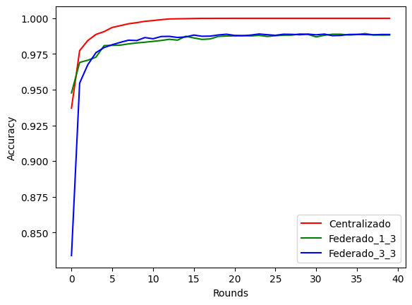

# Trabalho T1 – Implementação de Aprendizado Federado
## Integrantes: Bruno Menegaz, Gustavo Dutra, Leonardo Albergaria
---
## **Instruções para Compilação e Execução**

### **Inicializando Ambiente**

Para realizar a instalação, o primeiro passo é clonar o repositório para um diretório local e instalar o python em conjunto das bibliotecas utilizadas. Para realizar o download de todas as dependências, basta utilizando o seguinte comando:

```
$ pip3 install -r requirements.txt
```

### **Pré Estabelecendo a Base de Dados**

Como cada cliente roda em um processo distinto, é necessário dividir previamente a base de dados. Para isso, ao executar o programa *getSplitData*, são criadas pastas com dados para cada cliente. Dessa forma, cada cliente utilizará uma parte dos dados da base *Mnist* para realizar o treinamento. O repositório contém os dados separados para 3 clientes, então caso haja necessidade de usar uma quantidade diferente de clientes, deve ser executado o seguinte comando (5 clientes neste exemplo):

```
$ python3 getSplitData.py 5
```

### **Execução**

Em sequência, deve-se iniciar o servidor. É necessário passar como argumentos uma quantidade de clientes a serem treinado por round, uma quantidade mínima de clientes, uma quantidade máxima de rounds e uma meta de acurária. Em Linux, a linha de comando ficará da seguinte forma, para 2 clientes por round, mínimo de 2 clients, máximo de 10 rounds e accuracy target de 1.0:

```
$ python3 server.py 2 2 10 1.0
```

Por fim, devemos inicializar os clientes (utilizando um novo terminal para cada cliente). É necessário passar como argumento o ID do cliente, vale destacar que devemos obedecer a estrutura de diretórios criados em */mnist_data*, dessa forma o respectivo ID a ser passado deve se referir a uma pasta que tenha sido criada. A linha de comando do cliente de ID 1 que acessará os dados do diretório */mnist_data/client_1*, ficará da seguinte forma:

```
$ python3 client.py 1
```

---
## **Link para o vídeo no Youtube**

> https://drive.google.com/file/d/1FsVUoKMTNmcZCnra4a8NeBoQpfEOSrgd/view

---
## **Implementação**

### **Server**

#### **Funcionalidades**: 
 - Registro de clientes
 - Treinamento federado
 - Agregação de pesos
 - Atualização e validação do modelo global


#### **Funcionamento**:

O servidor é responsável por coordenar o treinamento federado. Ele recebe os parâmetros necessários para a configuração de um caso de teste, sendo esses o número de clientes a serem treinados em cada round, o número mínimo de clientes, o número total de rounds e uma meta de acurária. 

Dado o estabelecidamento do servidor em um ip pré-estabelecido, o primeiro passo no início de cada round é a verificação se o número mínimo de clientes foi alcançado, caso contrário, o server irá aguarda a conexão dos **N** clientes necessários antes de prosseguir.

Quando essa meta for atingida, o servidor irá sincronizar a disponibilidade para registrar novos clientes, utilizando a flag **available_for_register**, e iniciará uma nova rodada de treinamento. Há um incremento do número da rodada atual e a comunicação dessa informação para todos os clientes registrados. A partir daí, o servidor cria uma lista de clientes alvo selecionando aleatoriamente a partir dos clientes registrados, utiliza-se da função **aux.createRandomClientList()** para essa tarefa. Esses serão os clientes que irão treinar nesse round.

Após isso, o servidor faz a chamada de treinamento em paralelo. Cria-se uma lista de *threads* para chamar o método **__callClientLearning** para cada cliente alvo, passando o endereço IP do cliente selecionado e uma fila da classe **Queue** para armazenar os resultados do treinamento. Uma vez que todas as *threads* foram iniciadas, o servidor aguarda até que todas sejam concluídas.

Em seguida, inicia-se a captura das listas de pesos resultantes do treinamento de cada cliente, bem como o tamanho da amostra de cada cliente, armazenando-os nas listas **weights_clients_list** e **sample_size_list**, respectivamente. Após isso, inicia-se o calculo da média ponderada dos pesos, agregando-os através do método **__FedAvg**. Essa média ponderada representa o modelo global resultante do treinamento de cada cliente.

O servidor então chama o método **__callModelValidation** para atualizar os pesos dos clientes e validar o modelo global, retornando a acurácia local obtida. A partir desse retorno, calcula-se a média de todas as acurácias registradas e exibi-se esse resultado em conjunto ao número da rodada atual.

Se a acurácia global média atingir ou ultrapassar a meta de acurácia especificada, o servidor imprime uma mensagem indicando que a meta foi alcançada e encerra o processo de treinamento. Caso contrário, o servidor continua para a próxima rodada até que a meta de precisão seja atingida ou o número máximo de rounds seja alcançado.

### **Client**

#### **Funcionalidades**: 
 - Registro do cliente
 - Espera por comandos do servidor
 - Treinamento
 - Validação do modelo
 - Encerramento do cliente

#### **Funcionamento**:

O cliente

---
## **Resultados**

Para coletar uma série de resultados, a aplicação foi testada de duas formas, utilizando **3** clientes e treinando **1** cliente por round e utilizando **3** clientes e treinando **3** clientes por round. Vale destacar que também utilizamos a abordagem centralizada devenvolvida no *Laboratório_2* com fins de comparações entre as abordagens *Federada* e *Centralizada*.

> 

Analisando o gráfico, é possível perceber que as duas abordagens federadas tem resultados similares, apenas uma pequena superioridade na estabilidade para o caso de 3 clientes por round.

Tal resultado não condiz com o esperado quando imaginamos uma aplicação real, uma vez que o ideal seria o teste com um cliente por round performar de forma inferior, porém podemos explicar esse fenômeno da seguinte forma: como a base de dados foi dividida de forma homogênea para os clientes, onde cada um recebeu uma fração distintas de todos os *labels*, ocorreu que não houve uma disparidade significativa entre os *datasets* de cada indivíduo, dessa forma um modelo global que foi construído a partir dos pesos de um único cliente específico irá performar relativamente bem sob os dados de outros clientes, por conta da falta de particularidades.

## **Conclusão**

A partir dos testes realizados, concluímos que os resultados encontrados condizem com o que se esperava a partir do escopo do trabalho. Foi possível realizar os objetivos de implementar o aprendizado federado, construindo um modelo global que funciona pra todos os clientes, além da utilização da troca de mensagens entre os componentes a partir do gRPC.

Por fim, podemos destacar que, para um possível aprimoramento deste trabalho em estudos futuros, algo interessante a se fazer é a implementação de particularidades nos dados de cada cliente, dessa forma alcansaríamos uma aplicação mais real, na qual há uma divisão mais heterogenia do dataset.